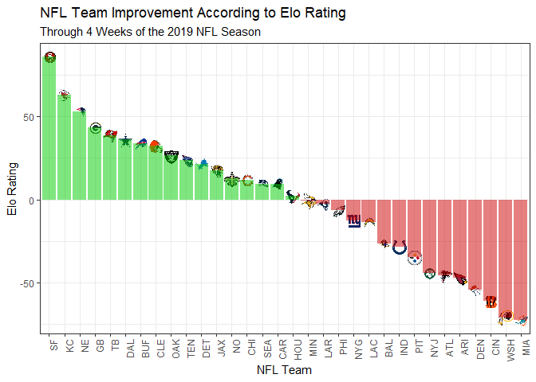

``` r
c("dplyr",
  "tidyverse",
  "ggthemes",
  "ggimage", 
  "RCurl",
  "gridExtra"
  ) -> package_names  
for(package_name in package_names) {
  if(!is.element(package_name, installed.packages()[,1])) {
     install.packages(package_name,
                      repos = "http://cran.mtu.edu/")
  }
  library(package_name, character.only=TRUE,
          quietly=TRUE,verbose=FALSE)
}
```

    ## 
    ## Attaching package: 'dplyr'

    ## The following objects are masked from 'package:stats':
    ## 
    ##     filter, lag

    ## The following objects are masked from 'package:base':
    ## 
    ##     intersect, setdiff, setequal, union

    ## -- Attaching packages ------------------------------ tidyverse 1.3.0 --

    ## v ggplot2 3.2.1     v purrr   0.3.3
    ## v tibble  2.1.3     v stringr 1.4.0
    ## v tidyr   1.0.2     v forcats 0.4.0
    ## v readr   1.3.1

    ## Warning: package 'readr' was built under R version 3.4.4

    ## Warning: package 'stringr' was built under R version 3.4.4

    ## Warning: package 'forcats' was built under R version 3.4.4

    ## -- Conflicts --------------------------------- tidyverse_conflicts() --
    ## x dplyr::filter() masks stats::filter()
    ## x dplyr::lag()    masks stats::lag()

    ## Warning: package 'RCurl' was built under R version 3.4.4

    ## 
    ## Attaching package: 'RCurl'

    ## The following object is masked from 'package:tidyr':
    ## 
    ##     complete

    ## 
    ## Attaching package: 'gridExtra'

    ## The following object is masked from 'package:dplyr':
    ## 
    ##     combine

``` r
rm(list=c("package_name", "package_names")) # clean up the environment

options(scipen = 999)
```

## Who Was the Most Improved NFL Team 4 weeks Into the 2019 NFL Season?

The dataset I acquired can be found here:
<https://github.com/fivethirtyeight/data/tree/master/nfl-elo>

It comes from a github repository featuring datasets from
fivethirtyeight. The dataset I intend to use contains NFL game-by-game
Elo ratings dating all the way back to 1920. I’m aiming to take the
difference between each team’s Elo rating after their week 4 games and
before their week 1 games. This will give a measure of how much each
team improved after the first quarter of the season compared to their
initial week 1 rating.

The Elo ratings I’m using are based on each team’s performance last
season. An average team has an Elo rating of 1500. If a team wins, their
Elo rating will always improve, and if they lose, their Elo eating will
always decline. Various factors are taken into account when assessing
how much a team’s Elo rating will change (e.g. strength of schedule),
and it’s meant to be used as a metric to compare each of the team’s to
one another.

``` r
# Desktop
read.csv("C:/Users/JVivs/Documents/COLLEGE/GRAD SCHOOL/GDAT515/nfl_elo.csv") -> nfl

# Filtering for weeks 1 through 4 in the 2019 NFL season
nfl[16275:16337,] -> nflteam_4_weeks

str(nflteam_4_weeks)
```

    ## 'data.frame':    63 obs. of  30 variables:
    ##  $ date          : Factor w/ 3441 levels "1920-09-26","1920-10-03",..: 3387 3388 3388 3388 3388 3388 3388 3388 3388 3388 ...
    ##  $ season        : int  2019 2019 2019 2019 2019 2019 2019 2019 2019 2019 ...
    ##  $ neutral       : int  0 0 0 0 0 0 0 0 0 0 ...
    ##  $ playoff       : Factor w/ 5 levels "","c","d","s",..: 1 1 1 1 1 1 1 1 1 1 ...
    ##  $ team1         : Factor w/ 101 levels "AKR","ARI","ATL",..: 16 49 13 60 58 75 21 71 87 53 ...
    ##  $ team2         : Factor w/ 108 levels "ABU","AKR","ARI",..: 45 52 59 4 6 108 98 13 21 50 ...
    ##  $ elo1_pre      : num  1589 1455 1519 1538 1415 ...
    ##  $ elo2_pre      : num  1455 1602 1598 1520 1571 ...
    ##  $ elo_prob1     : num  0.758 0.384 0.48 0.617 0.373 ...
    ##  $ elo_prob2     : num  0.242 0.616 0.52 0.383 0.627 ...
    ##  $ elo1_post     : num  1554 1435 1506 1559 1387 ...
    ##  $ elo2_post     : num  1490 1622 1611 1499 1599 ...
    ##  $ qbelo1_pre    : num  1560 1484 1514 1540 1376 ...
    ##  $ qbelo2_pre    : num  1519 1608 1590 1522 1536 ...
    ##  $ qb1           : Factor w/ 616 levels "","A.J. Feeley",..: 427 433 94 365 489 97 27 496 485 455 ...
    ##  $ qb2           : Factor w/ 633 levels "","A.J. Feeley",..: 5 462 272 423 385 101 400 349 17 264 ...
    ##  $ qb1_value_pre : num  175 172 177 175 161 ...
    ##  $ qb2_value_pre : num  192 222 154 231 123 ...
    ##  $ qb1_adj       : num  5.973 14.392 1.456 0.368 12.771 ...
    ##  $ qb2_adj       : num  2.88 6.97 -2.03 10.92 -9.25 ...
    ##  $ qbelo_prob1   : num  0.64 0.416 0.475 0.593 0.387 ...
    ##  $ qbelo_prob2   : num  0.36 0.584 0.525 0.407 0.613 ...
    ##  $ qb1_game_value: num  -36.6 88.4 49.4 127.9 21.1 ...
    ##  $ qb2_game_value: num  74.7 433.2 64.2 210.6 422.5 ...
    ##  $ qb1_value_post: num  154 163 165 171 147 ...
    ##  $ qb2_value_post: num  180 243 145 229 153 ...
    ##  $ qbelo1_post   : num  1533 1462 1501 1562 1347 ...
    ##  $ qbelo2_post   : num  1547 1630 1603 1500 1566 ...
    ##  $ score1        : int  3 26 27 28 10 32 13 16 21 30 ...
    ##  $ score2        : int  10 40 30 12 59 27 43 17 20 24 ...

``` r
# Filtering for the variables of interest
# Data is organized by game; therefore, collecting all home team stats in one data frame and all away team stats into another data frame to later combine
nflteam_4_weeks %>%
  select(., "date", "team1", "elo1_pre", "elo1_post") -> df4weeks_team1

nflteam_4_weeks %>%
  select(., "date", "team2", "elo2_pre", "elo2_post") -> df4weeks_team2

# Giving both data frames a common column name to bind later
df4weeks_team1$team <- df4weeks_team1$team1
df4weeks_team2$team <- df4weeks_team2$team2

# Binding the two data frames
newdf_4weeks_team <- bind_rows(df4weeks_team1, df4weeks_team2)
```

    ## Warning in bind_rows_(x, .id): Unequal factor levels: coercing to character

    ## Warning in bind_rows_(x, .id): binding character and factor vector, coercing
    ## into character vector
    
    ## Warning in bind_rows_(x, .id): binding character and factor vector, coercing
    ## into character vector

``` r
newdf_4weeks_team %>%
  select(., 1,3,4,5,7,8) -> newdf_4weeks_team

# Same thing for pre and post qb values
newdf_4weeks_team$elo1_pre[is.na(newdf_4weeks_team$elo1_pre)] <- newdf_4weeks_team$elo2_pre[is.na(newdf_4weeks_team$elo1_pre)]

newdf_4weeks_team$elo1_post[is.na(newdf_4weeks_team$elo1_post)] <- newdf_4weeks_team$elo2_post[is.na(newdf_4weeks_team$elo1_post)]

# Arranging by date (Start from week 1 to week 4)
newdf_4weeks_team %>%
  arrange(., date) %>% 
  select(., 1:4) %>%
  rename(., team_code = team, elo_pre = elo1_pre, elo_post = elo1_post) -> newerdf_4weeks_team

# Creating a difference column (elo after week 4 - elo before week 1)

# Week 1 data
newerdf_4weeks_team %>%
  slice(., 1:32) %>%
  arrange(., team_code) -> week1_team

# Week 4 data (Including week 3 data for SF and NYJ since they had bye weeks in week 4)
newerdf_4weeks_team %>%
  slice(., 78, 82, 97:126) %>%
  arrange(., team_code) -> week4_team

week4_team$elo_post - week1_team$elo_pre -> week4_team$diff_value
```

I found a dataset that features each of the 32 NFL teams’ logos at
<https://statsbylopez.netlify.com/post/nfl-team-logos-using-ggimage/>

To make this bar graph visually appealing, I wanted to add each team’s
logo to their respective performance measure. In order to do this, I
need to merge the dataset created above with this dataset on a common
column name (in this case, team\_code). Once merged, I can use ggimage
to load in the team’s logo through the use of the url column in the
provided dataset which leads to a PNG of their respective logo.

``` r
# NFL Team Logos
url.logo <- getURL("https://raw.githubusercontent.com/statsbylopez/BlogPosts/master/nfl_teamlogos.csv")
df.logos <- read.csv(text = url.logo)

str(df.logos)
```

    ## 'data.frame':    32 obs. of  3 variables:
    ##  $ team     : Factor w/ 32 levels "Arizona Cardinals",..: 1 2 3 4 5 6 7 8 9 10 ...
    ##  $ team_code: Factor w/ 32 levels "ARI","ATL","BAL",..: 1 2 3 4 5 6 7 8 9 10 ...
    ##  $ url      : Factor w/ 32 levels "https://upload.wikimedia.org/wikipedia/commons/thumb/0/00/Indianapolis_Colts_logo.svg/100px-Indianapolis_Colts_logo.svg.png",..: 19 29 10 22 11 6 8 30 2 14 ...

``` r
# Converting logo column to character
as.character(df.logos$team_code) -> df.logos$team_code

# Renaming two team abbreviations to match those in newerdf_4weeks
df.logos$team_code[18] <- c("LAR")
df.logos$team_code[32] <- c("WSH")

# Merging the two data frames together by the team_code column so logos can load in from URL provided in df.logos
merge(week4_team, df.logos, by = "team_code") -> finaldf_team
```

``` r
# Arranging by highest to lowest
finaldf_team %>%
  arrange(., desc(diff_value)) -> finaldf_team

# Plotting the elo differences
ggplot(finaldf_team, aes(x = reorder(team_code, -diff_value), y = diff_value)) + 
  geom_image(aes(image = url), size = 0.04) +
  geom_bar(aes(fill = diff_value < 0), stat = "identity", alpha = 0.5) + 
  scale_fill_manual(guide = FALSE, breaks = c(TRUE, FALSE), values = c("green3", "red3")) + 
  theme_bw() + 
  theme(axis.text.x = element_text(angle = 90, hjust = 1)) + 
  xlab("NFL Team") + 
  ylab("Elo Rating") + 
  ggtitle("NFL Team Improvement According to Elo Rating", subtitle = "Through 4 Weeks of the 2019 NFL Season") -> diff_plot_team

diff_plot_team
```

<!-- -->

This visualization allows us to see which teams improved from their
initial elo ratings (colored green), and which teams regressed (colored
red). I arranged it in a descending order so that we can read the graph
left to right. This also allows us to quickly answer the question posed
as to which team improved the most through 4 weeks of the 2019 NFL
Season (San Francisco 49ers). It’s important to note that the 49ers and
Jets did not play games in week 4 due to having a bye week; so I
included their post-week 3 Elo rating into the dataset, and substracted
their initial week 1 ratings from that.

By looking at this graph, we can also see which team regressed the most
(Miami Dolphins), so I think it’s beneficial having a bar graph in this
order as it allows us to glean on other insights aside from the initial
question.
